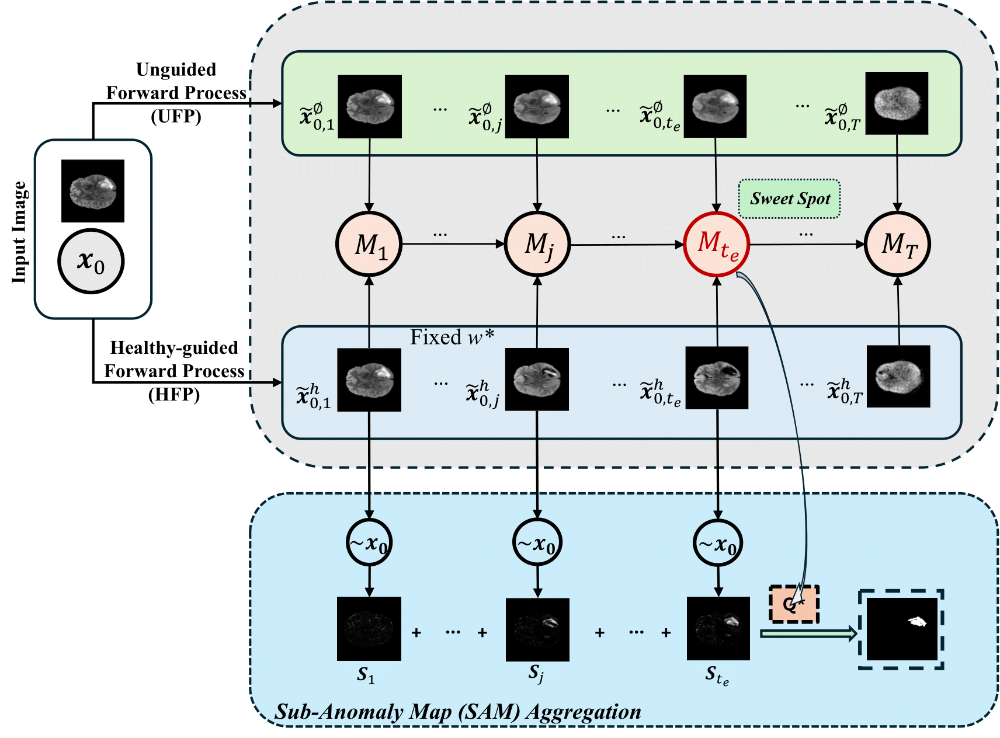

# Pytorch implementation of AnoFPDM

[AnoFPDM: Anomaly Segmentation with Forward Process of Diffusion Models for Brain MRI](https://arxiv.org/abs/2404.15683) 
[Yiming Che](https://soloche.github.io/)<sup>1,2</sup>, 
[Fazle Rafsani](https://labs.engineering.asu.edu/wulab/person/fazle-rafsani/)<sup>1,2</sup>, 
[Jay Shah](https://www.public.asu.edu/~jgshah1/)<sup>1,2</sup>, 
[Md Mahfuzur Rahman Siddiquee](https://mrahmans.me/)<sup>1,2</sup>,
[Teresa Wu](https://labs.engineering.asu.edu/wulab/person/teresa-wu-2/)<sup>1,2</sup>,

<sup>1</sup>ASU-Mayo Center for Innovative Imaging,
<sup>2</sup>Arizona State University,

(our paper is accepted by WACV 2025 ASTAD workshop)

## Abstract
Weakly-supervised diffusion models (DMs) in anomaly segmentation, leveraging image-level labels, have attracted significant attention for their superior performance compared to unsupervised methods. It eliminates the need for pixel-level labels in training, offering a more cost-effective alternative to supervised methods. However, existing methods are not fully weakly-supervised because they heavily rely on costly pixel-level labels for hyperparameter tuning in inference. To tackle this challenge, we introduce Anomaly Segmentation with Forward Process of Diffusion Models (AnoFPDM), a fully weakly-supervised framework that operates without the need of pixel-level labels. Leveraging the unguided forward process as a reference for the guided forward process, we select hyperparameters such as the noise scale, the threshold for segmentation and the guidance strength. We aggregate anomaly maps from guided forward process, enhancing the signal strength of anomalous regions. Remarkably, our proposed method outperforms recent state-of-the-art weakly-supervised approaches, even without utilizing pixel-level labels.



## Dataset
We use [Brain MRI dataset](https://www.kaggle.com/datasets/dschettler8845/brats-2021-task1) and [ATLAS v2.0 dataset](https://fcon_1000.projects.nitrc.org/indi/retro/atlas.html). The two brain datasets are preprocessed and saved by `preprocess.py`. The preprocessed data is saved in the following structure:

```
preprocessed_data/
    ├── npy_train/
  	    ├──patient_BraTS2021_id/
	        ├── xxx.npy
    ├── npy_val/
  	    ├──patient_BraTS2021_id/
            ├── xxx.npy
    ├──npy_test/
  	    ├──patient_BraTS2021_id/
            ├── xxx.npy
```

## Usage
The training is optimized for multi-GPU training using `torchrun` while the evaluation is for single-GPU.  Here is the specific steps:
1. preprocess the BraTS21 data by `preprocess.py`
2. train the model by `./scripts/train.py` with the corresponding config file
3. segment the anomaly by `./scripts/translation_[method].py` with the corresponding config file

### Model:
We provide the training script for unguided DM, classifier-guided DM and classifier-free DM. You can run the training script by:
`sbatch` on Slurm job scheduler or `bash` on local machine (please comment out any Slurm related setups). 

Method | traning config | evaluation config|
--- | --- | --- |
Unguided DM | `./config/run_train_brats_anoddpm.sh` | `./config/run_translation_anoddpm.sh` |
Classifier-guided DM | `./config/run_train_brats_clf_guided.sh`, `./config/run_train_brats_clf.sh`| `./config/run_translation_clf_guided.sh` |
Classifier-free DM | `./config/run_train_brats_clf_free_guided.sh` | `./config/run_translation_fpdm.sh` (ddim forward in paper), `./config/run_translation_ddib.sh` (ddib in paper) |

Note: you need to set some path variables in the config files., e.g., `--data_dir` and `--model_dir`.